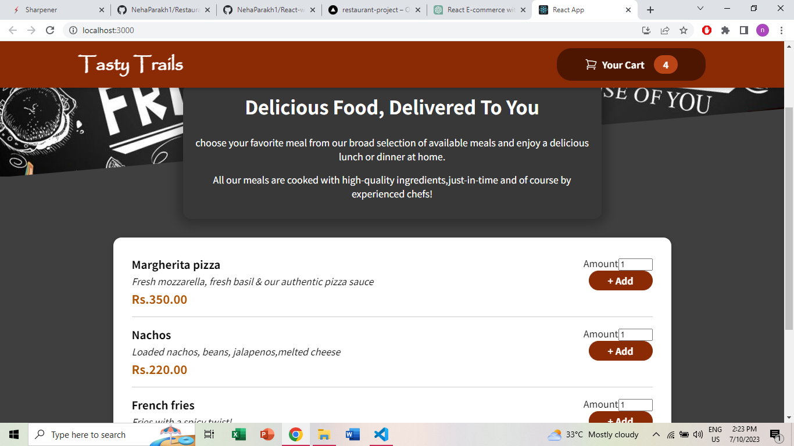
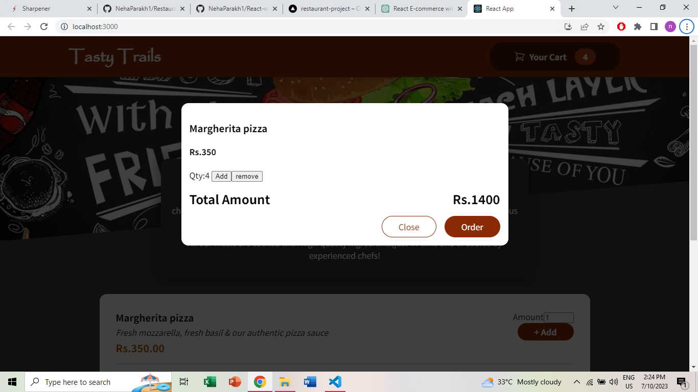

# Restaurant-Project

This is a one-page restaurant project that allows users to view a menu of various food items and add them to their cart. Users can adjust the quantity of items in the cart, add more items, and remove items as needed.

# Features

1. The project displays a menu of food items, including their names, descriptions, prices. Users can easily browse through the menu to choose their desired items as needed.
2. Users can add items to their cart by selecting the desired quantity. The cart dynamically updates to show the added items along with the total price.
3. Users can also adjust the quantity of items in the cart or remove items if needed.

# Technologies Used

1. React
2. Context API
3. HTML
4. CSS
5. Javascript

# Demo

https://restaurant-project-six.vercel.app/

# Images of the app

